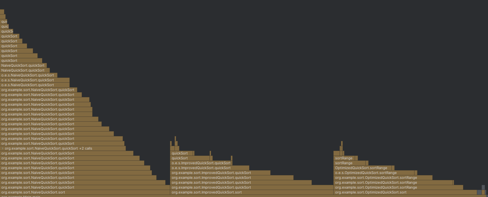

# Лабораторная работа 1: Сортировки

## Описание
В данной лабораторной работе реализованы и протестированы три варианта сортировки массива чисел:  

1. **NaiveQuickSort** — базовая реализация быстрой сортировки.  
2. **ImprovedQuickSort** — оптимизированная версия с улучшенным выбором опорного элемента.
3. **OptimizedQuickSort** — версия с дополнительными оптимизациями (хвостовая рекурсия, вставки для маленьких подмассивов).

Цель работы — изучение производительности различных алгоритмов сортировки и анализ их поведения на больших объемах данных.

## **NaiveQuickSort**
### Характеристики:
- Pivot: последний элемент массива arr[high]
- Partition: Lomuto scheme (один указатель)
- Рекурсия: полная (два рекурсивных вызова)
### Сложность
- Лучший/Средний: O(n log n)
- Худший: O(n²) при отсортированном массиве

## **ImprovedQuickSort**
### Характеристики:
- Pivot: медиана из 3-х элементов (low, mid, high)
- Partition: Hoare scheme (два указателя)
- Рекурсия: оптимизированная (tail recursion)
### Сложность
- Лучший/Средний: O(n log n)
- Худший: O(n^(4/3))

## **OptimizedQuickSort**
### Характеристики:
- Pivot: медиана из 3-х элементов (low, mid, high)
- Partition: Hoare scheme (два указателя)
- Рекурсия: tail recursion + выбор меньшей части
- Insertion Sort: для массивов < 16 элементов
- Двойная проверка: INSERTION_THRESHOLD везде
### Сложность
- Лучший/Средний: O(n log n)
- Худший: O(n^(4/3))
- Малые массивы: O(n²) → O(n) с insertion sort
## Гипотезы
Основная гипотеза: Поэтапная оптимизация QuickSort даст ощутимый прирост скорости за счёт устранения главных узких мест:
- Hoare partition + median-of-3 ускорят работу за счёт меньшего количества swap-операций и более умного выбора опорного элемента.
- Tail recursion (цикл while(l < r) + рекурсия только на меньшую часть) сильно уменьшит число рекурсивных вызовов — вместо двух вызовов на каждую итерацию делается только один.
- Insertion Sort для маленьких массивов заменит неэффективную рекурсию QuickSort на простую линейную сортировку, полностью исключая рекурсивные вызовы на малых подмассивах.
- Ожидаемый результат: Каждый шаг оптимизации даст прибавку скорости. Второй и третий варианты будут иметь гораздо меньше рекурсий за счёт tail recursion + insertion sort. OptimizedQuickSort станет лидером.
## Бенчмарки
Результат бенчмарков:
|  | 100k        | 500k        | 1M          |
|-----------------------|-------------|-------------|-------------|
| **Нативный**          | **8.27ms**  | **45.62ms** | **92.98ms** |
| **Улучшенный**        | **6.73ms**  | **38.62ms** | **81.46ms** |
| **Оптимизированный**  | **5.78ms**  | **33.14ms** | **69.40ms** |
## Профилирование

Анализ: Гистограмма профилирования горячих методов показывает значительно большее количество рекурсивных вызовов процедуры в первом алгоритме (Нативный QuickSort с Lomuto partition), что обусловлено отсутствием оптимизаций. Второй и третий алгоритмы демонстрируют сопоставимое количество вызовов, однако третий алгоритм (Оптимизированный QuickSort) получает преимущество за счет замены рекурсии на insertionSort для малых подмассивов (<16 элементов), что существенно снижает накладные расходы и общее время выполнения.  

График JProfiler телеметрии CPU демонстрирует значительно меньшую пиковую нагрузку для третьего алгоритма (OptimizedQuickSort, зеленая линия) по сравнению с первым (Нативный QuickSort, синяя линия), где наблюдаются резкие скачки загрузки процессора. Второй алгоритм занимает промежуточное положение.
## Модульные тесты 
Покрытие (Clover):
| Алгоритм          | Методы | Строки |
|-------------------|--------|--------|
| **Нативный**      | 3/3    | 93.9%  |
| **Улучшенный**    | 5/5    | **96.4%** |
| **Оптимизированный** | 5/5 | 96.1%  |

## Выводы
В рамках лабораторной работы "Изучение инструментов профилирования и анализа производительности Java-приложений" успешно выполнены все поставленные задачи:
- Реализованы три версии QuickSort с поэтапными оптимизациями: от базовой Lomuto-реализации до гибридного алгоритма с Hoare partition, tail recursion и insertion sort.
Подтверждены гипотезы об оптимизациях:
- Hoare partition сокращает swap-операции
- Tail recursion уменьшает глубину рекурсии
- Insertion sort эффективнее QuickSort на малых массивах
JMH-бенчмарки демонстрируют прирост производительности: OptimizedQuickSort на 25% быстрее Native (69ms vs 93ms на 1M элементов).
Профилирование подтверждает результаты.  
Изучены инструменты:
- JMH для точных микробенчмарков
- IntelliJ Profiler для анализа горячих методов
- JProfiler для телеметрии CPU/GC
- JUnit + Clover для проведения модульного тестирования
